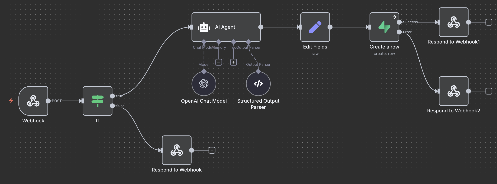
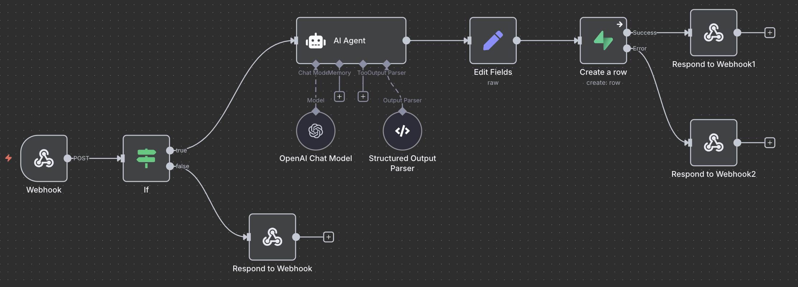

# Article Summarizer - Technical Exercise

A NextJS + Supabase + n8n (OpenAI) application that fetches news articles, allows users to add context, and generates AI-powered summaries.

## 🏗️ Technical Stack

- **Frontend**: Next.js 15.5.2 + React 19 + TypeScript
- **Database**: Supabase (PostgreSQL + Auth)
- **AI Processing**: n8n + OpenAI GPT
- **Styling**: Tailwind CSS + Shadcn UI

### 📷 App Screenshot

You can find a sample screenshot of the Article Summarizer app below:


## 🚀 Quick Start

### Prerequisites

- Node.js 18+
- pnpm (recommended)

### 1. Installation

```bash
git clone <repository-url>
cd phew-ai-technical-exercise
pnpm install
```

### 2. Environment Setup

Create `.env`:

```env
# External Articles API (provided)
NEXT_PUBLIC_ARTICLES_API_URL=https://n8n.phew.ai/webhook-test/articles
NEXT_PUBLIC_ARTICLES_API_KEY=50d8c50c-11e1-4bc7-b36c-d3f88ddfe407

# n8n Workflow (your instance)
NEXT_PUBLIC_N8N_URL=https://your-n8n-instance.com
NEXT_PUBLIC_N8N_API_KEY=your_n8n_api_key

# Supabase (your project)
NEXT_PUBLIC_SUPABASE_URL=https://your-project.supabase.co
NEXT_PUBLIC_SUPABASE_PUBLISHABLE_KEY=your_supabase_anon_key
```

### 3. Supabase

#### Database Schema

```sql
-- Article summaries table
CREATE TABLE article_summaries (
  id UUID DEFAULT gen_random_uuid() PRIMARY KEY,
  user_id UUID REFERENCES auth.users(id) ON DELETE CASCADE,
  article_id TEXT NOT NULL,
  article_title TEXT NOT NULL,
  article_content TEXT NOT NULL,
  user_context TEXT NOT NULL,
  summary TEXT NOT NULL,
  created_at TIMESTAMP WITH TIME ZONE DEFAULT NOW(),
  updated_at TIMESTAMP WITH TIME ZONE DEFAULT NOW()
);

-- Article likes for engagement scoring
CREATE TABLE article_likes (
  id UUID DEFAULT gen_random_uuid() PRIMARY KEY,
  user_id UUID REFERENCES auth.users(id) ON DELETE CASCADE,
  article_id TEXT NOT NULL,
  created_at TIMESTAMP WITH TIME ZONE DEFAULT NOW()
);

-- AI quality scores
CREATE TABLE article_scores (
  id UUID DEFAULT gen_random_uuid() PRIMARY KEY,
  article_id TEXT NOT NULL,
  score DECIMAL(3,1) CHECK (score >= 0 AND score <= 10),
  created_at TIMESTAMP WITH TIME ZONE DEFAULT NOW()
);
```

### 4. Development

```bash
pnpm dev
```

Visit `http://localhost:3000`

## 📋 API Specifications

### External Articles API (Provided)

```
GET https://n8n.phew.ai/webhook-test/articles
Headers: { "x-api-key": "50d8c50c-11e1-4bc7-b36c-d3f88ddfe407" }

Response: [{
  id: string,
  title: string,
  thumbnail_url: string,
  url: string,
  content: string,
  datetime: string
}]
```

## 🎨 Design Decisions & Tradeoffs

### Architecture Choices

#### **Next.js**

Chose Next.js for its hybrid rendering, server actions, and App Router, which simplify building both frontend and backend in a single framework. This reduces stack complexity and improves performance.

**Trade-offs**: The learning curve for the App Router and server components is higher compared to a traditional React setup. The framework also introduces conventions that can feel restrictive when deviating from its opinionated structure.

#### **Server Actions**

Adopted Server Actions with next-safe-action to keep sensitive operations on the server while ensuring type safety and validation. This avoids boilerplate API routes, improves maintainability, and enforces secure data handling.

#### **Shadcn UI**

Implemented shadcn/ui for the UI layer due to its accessibility, flexibility, and seamless integration with Tailwind CSS. It enables rapid development while maintaining full control over styling and branding.

**Trade-offs:** Unlike full UI kits (e.g., Material UI), shadcn/ui requires more responsibility for maintaining design consistency and theming. It offers flexibility at the cost of more manual customization.

### **N8N Flows Created**

To improve article ranking, I created an n8n workflow that automatically scores each article using OpenAI. The goal is to ensure that users are always presented with the most relevant and high-quality content.



Alongside article scoring, I also built an n8n workflow to generate concise summaries that blend the article’s content with the user’s own input/context.



### **Engagement-Based Article Sorting (Bonus Feature)**

It was developed social-proof model. Users would be able to upvote or “like” the articles they find most interesting. This approach not only helps surface the best articles but also encourages users to actively participate, creating a sense of community and increasing retention.

- **Algorithm**: Multi-factor scoring system
- **Formula**: `AI Score × 5 + Likes Count + Time Decay × 2`
- **Rationale**: Balances content quality, user engagement, and freshness
- **Implementation**:
  - AI scores stored in `article_scores` table
  - User likes tracked in `article_likes` table
  - Time decay factor for recency bonus

1. **AI Quality Score** (weight: 5x) - Generated by analyzing article content
2. **User Engagement** (weight: 1x) - Based on like count
3. **Recency Factor** (weight: 2x) - Time decay for freshness

- **Tradeoff**: Complex algorithm, but provides better content discovery

#### **Possible Improvements**

One way to sort articles from best to worst would be to make the ranking dynamic, based on how users interact with the content. I would implement an engagement-driven ranking system. Each article could receive a score that increases when users select it, add their own context, or click on the source link. Over time, this scoring system would learn which articles are most attractive and push them higher in the feed, ensuring new users see the most engaging content first.

## 📁 Project Structure

```
src/
├── app/
│   ├── (dashboard)/          # Protected routes
│   │   ├── page.tsx         # Articles listing
│   │   └── summaries/       # User summaries
│   └── auth/                # Authentication
├── components/
│   ├── articles/            # Article components
│   ├── summaries/           # Summary components
│   └── ui/                  # Shadcn UI components
├── lib/
│   ├── supabase/           # Supabase config
│   └── api.ts              # API clients
├── server/actions/         # Server actions
├── types/                  # TypeScript types
└── hooks/                  # Custom hooks
```
